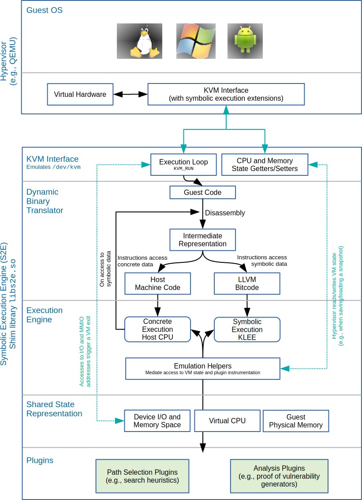
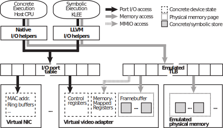

=========================
Design and Implementation
=========================

In this chapter, we show how we implemented selective symbolic execution
in the S2E prototype. This system is meant to be a platform
for rapid prototyping of custom system/program analyses that employ
various execution consistency models. S2E offers two key
interfaces, one for path selection and one for analysis; we describe
these interfaces further in Chapter [chapter:developing\_tools].
S2E explores paths by running the target system in a virtual
machine and selectively executing selected parts of it symbolically.
Depending on which parts are desired, some of the machine instructions
of the system being analyzed are dynamically translated within the
VM into an intermediate representation suitable for symbolic execution,
while the rest are translated to the host instruction set. Underneath
the covers, S2E transparently converts data back and forth
as execution weaves between the symbolic and concrete domains, so as to
offer the illusion that the full system (OS, libraries, applications,
etc.) is executing in multi-path mode.

Figure [fig:arch] shows the S2E architecture. We reused
parts of the QEMU  virtual machine, the
KLEE  symbolic execution engine, and the LLVM  tool
chain. To these, we added 30 KLOCof C++ code
written from scratch, not including third party libraries. We added
1 KLOC of new code to KLEE  and modified 1.5 KLOC; in QEMU , we added 1.5
KLOC of new code and modified 3.5 KLOC of existing code.
S2E currently runs on Mac OS X and Linux, it can execute any
guest OS that runs on x86 or ARM (e.g., Android OS), and can be easily
extended to other CPU architectures, like MIPS or PowerPC.

In the rest of this section, we explain how S2E uses dynamic
binary translation (§[sec:impl-DBT ]), how the execution engine handles
concretely and symbolically running code (§[sec:impl-exec]), and the
details of the plugin infrastructure (§[sec:impl-plugins]). Finally, we
conclude the section with some of the optimizations that are key to
making the illusion of whole-system symbolic execution feasible
(§[sec:impl-opt]).

S2E architecture, centered around a custom VM. The
VM dynamically dispatches guest machine instructions to the host CPU
for native execution, or to the symbolic execution engine for
symbolic interpretation, depending on whether the instructions access
symbolic data or not. The system state is shared between the code
running natively and the code interpreted in the symbolic execution
engine; this enables S2E to achieve the level of
execution consistency desired by the user.

Dynamic Binary Translation
==========================

In this section, we first discuss the general idea behind dynamic binary
translation and how it enables building a platform such as
S2E. We then illustrate it by looking at how
S2E leverages the dynamic binary translator offered by QEMU .

Binary translation in general is a powerful technique for code
instrumentation and is therefore a cornerstone of many tools. Static
binary translation has been originally used to run software compiled for
one architecture on another, without recompiling
it :raw-latex:`\cite{sites:bt}`. Dynamic binary translation has been
used among others to simulate entire
systems :raw-latex:`\cite{simos, bellard:QEMU }`, implement virtual
machine monitors :raw-latex:`\cite{vmware-tocs}`, and instrument
code :raw-latex:`\cite{pin}`.

A dynamic binary translator (DBT) converts at run-time the executable
code of one platform to executable code of another. A DBT works in a
loop: it continuously fetches blocks of guest code, translates them to
the host's instruction set, and passes the resulting translation to the
execution engine. The DBT determines which code to fetch and translate by
reading the state of the virtual CPUand the guest memory (i.e., the
current program counter in the CPUand program code stored in memory).
This state is updated as part of the execution of the translated code.

In the context of S2E , a DBT brings several advantages. The
DBT allows inserting arbitrary code in the guest instruction stream in
order to create symbolic values, instrument all memory and register
accesses to ensure a consistent synchronization between the symbolic and
concrete domain  (§[sec:state\_sharing]), provide symbolic
hardware (§[sec:symbhw]), and to call plugin code when interesting guest
instructions are executed (§[sec:impl-plugins]).

First, the DBT translates guest instructions to an intermediate
representation consisting of simpler *micro-operations*.
Micro-operations split complex guest instructions into simpler
operations that are easier to emulate. Consider the x86 instruction inc
[eax], which increments the value in the memory location whose address
is stored in the eax register. The DBT decomposes this instruction into a
memory load to a temporary register, an increment of that register, and
a subsequent memory store to the original location.

The DBT packages micro-operations into *translation blocks*. A
translation block contains a sequence of micro-operations up to and
including the first micro-operation that modifies the control flow, such
as a branch, a call, or a return. The translator cannot add to the
translation block the instructions past the control flow change, because
the translator cannot always determine statically at which code location
to continue the translation process.

The DBT transforms the micro-operations forming the translation block
into machine instructions of the host instruction set by turning each
micro-operation into an equivalent sequence of host instructions, using
a code dictionary that maps micro-operations to host instructions. Most
of the conversions consist of a one-to-one mapping from a
micro-operation to the corresponding machine instruction. For more
complex instructions, like those that manipulate the processor's control
state or that access memory, the DBT emits a micro-operation that calls
emulation helpers (which are C functions that emulate the original guest
machine instruction). Some helpers have tens of lines of code and are
used frequently (e.g., for memory accesses), therefore inlining them in
the translated code would be prohibitively expensive in terms of
generated code size.

Micro-operations simplify the translation process by abstracting away
the guest's instruction set. Without such an IR, translation would
require a different translator for every pair of guest and host
instruction sets. For example, supporting 8 guest platforms and 4 hosts
would require 32 translators. In contrast, the use of an IR requires only
8 *front-ends* (to transform the guest code to the IR) and 4 *back-ends*
(to convert the IR to the host's instruction set).

S2E uses QEMU for dynamic binary translation. QEMU comes with
many front-ends, including Alpha, ARM, x86, Microblaze, Motorola 68K,
MIPS, PowerPC, and SPARC. Back-ends include ARM, x86, MIPS, SPARC,
PowerPC, and PowerPC 64. QEMU can run x86 Windows on a MIPSmachine by
translating the x86 code to the MIPSinstruction set.

Dynamic Binary Translation for Symbolic Execution
=================================================

In order to enable symbolic execution, one needs to interpret the
IR generated by the DBT. For each micro-operation, the interpreter
fetches the value of its operands (that are possibly symbolic), performs
the operation specified by the micro-operation (possibly producing a new
symbolic expression), and storing the result to the appropriate register
or memory location.

To provide acceptable performance, the IR must be translated to
native code as often as possible, using a native back-end. The native
back-end allows running at full speed code that does not manipulate
symbolic data. Native execution is triggered as soon as the CPU's
register state becomes concrete. The native code must however be
instrumented in order to switch execution to the symbolic interpreter as
soon as a memory read returns a symbolic value.

In the rest of this chapter, we show how we modified QEMU's DBT in order
to enable symbolic execution and switching between symbolic and native
mode.

Translating to Native Code
--------------------------

We extended QEMU's native x86-64 back-end to run S2E on
64-bit Windows hosts. First, since Windows uses a different calling
convention from Linux, supporting Windows required us to change how the
DBT allocates host CPU registers in order to pass parameters to QEMU helper
functions. Second, we also turned pointers to longs into ``uintptr_t``s,
because longs are always 32-bit on Windows, even in 64-bit mode. Third,
since native code cannot manipulate symbolic data, we inserted a check
that aborts the execution of native code when a symbolic value is
detected (§[sec:impl-exec]).

We added the LLVM back-end to QEMU to interface
S2E with the KLEE symbolic execution engine. This back-end
translates micro-operations to the LLVM intermediate representation,
which is directly interpretable by KLEE (see §[sec:impl-exec]). Neither
the guest OS nor KLEE are aware of the x86-to-LLVM translation: the guest
OS sees that its instructions are being executed, and KLEE only sees
LLVM instructions, just as if they were coming from a program entirely
compiled to LLVM . In this way, the guest thinks the "entire world" is
concrete, while KLEE thinks the "entire world" is symbolic.

The DBT must translate code in a way that allows precise exception
handling, given that execution could be interrupted at any time by
hardware interrupts, page faults, etc. S2E extends the DBT to
enable precise exception handling from LLVM code. When an exception
occurs, QEMU converts the address of the *translated* instruction that
raised the exception to the program counter of the *guest* code. Such a
conversion is possible because each guest instruction corresponds to a
clearly delimited sequence of host machine instructions. However, there
is no such clear correspondence in LLVM code, because LLVM applies more
aggressive optimizations within each translation block. To solve this,
we modified the DBT to insert micro-operations that explicitly update the
program counter before each guest instruction is executed. As a result,
both the LLVM code and the native code see a consistent program counter
at every point during execution, allowing precise exception handling.

Execution Engine
================

We now present the extensions to QEMU's execution engine that enable
transparent switching between concrete and symbolic execution, while
preserving the consistency of the execution state.

The execution engine consists of a loop that calls the DBT to translate
guest code, then runs the translated code in native mode or interprets
it in the symbolic execution engine. The execution engine does not know
a priori whether to ask the DBT to generate LLVM or native code. It first
instructs the DBT to generate native code and, if the code reads memory
locations that contain symbolic data, it invokes the DBT to retranslate
the code to LLVM. The DBT stores the translations in a cache to avoid
needless retranslations, such as when repeatedly executing a loop body.

S2E mediates access to most of the VM state via *emulation
helpers*. While simple instructions can access the CPU state directly,
memory accesses, device I/O, as well as complex manipulations of the
CPU state go through specific helpers, in order to reduce the size of the
translated code. For example, the translated code for the software
interrupt instruction triggers during execution the ``do_interrupt``
helper. This helper emulates the instruction's behavior by checking the
current execution mode and privilege level, saving registers, taking
care of potential exceptions, etc.

S2E provides emulation helpers both for concrete (native)
execution and symbolic (LLVM) execution. Native-mode helpers mediate
access to the shared state when S2E executes concrete code
on the host CPU, while LLVM helpers are used in symbolic execution mode.
The execution engine runs native-mode helpers on the host CPU and
interprets LLVM helpers in the symbolic execution engine; LLVM helpers
must sometimes call native-mode QEMU code, for example to simulate a
virtual device.

LLVM emulation helpers avoid forceful unnecessary concretizations that
would arise from calling native emulation helpers from within KLEE. The
emulation helpers, called by the translated code, are compiled twice: to
x86 and to LLVM. When running in symbolic mode, KLEE executes the LLVM
version of the helper in order to let the helper manipulate symbolic
data. If that version was missing, KLEE would be forced to call the
native x86 version of the helper, which would then forcefully concretize
the symbolic data. For example, QEMU implements bit-shift operations in
helpers; if the bit-shift helper was available in x86 form only, the
data it manipulates would have to be concretized when called from KLEE.

Sharing State Between Symbolic and Concrete Domains
---------------------------------------------------

S2E combines concrete with symbolic execution in a
controlled fashion along the same path by using a representation of
machine state that is shared between the VM and the embedded symbolic
execution engine. S2E redirects reads and writes from
QEMU and KLEE to the common machine state, which consists of VM physical
memory, virtual CPU state, and virtual device state (see Figure 
[fig:shared-hw]). In this way, S2E can transparently convert
data between concrete and symbolic, according to the desired consistency
model, and provide distinct copies of the entire machine state to
distinct paths. S2E reduces the memory footprint of all
these system states by several orders of magnitude through copy-on-write
(§[sec:impl-opt]).

S2E implements transparent state sharing by using KLEE's
``ObjectState`` data structure for the CPU and the physical memory. This
structure encapsulates an array of concrete bytes and symbolic
expressions. It provides accessors to get and set concrete or symbolic
bytes. To execute native code more efficiently, S2E extends
``ObjectState`` to expose a direct pointer to the concrete array of bytes,
bypassing getters and setters. It also exposes a pointer to a bitmap
that indicates which bytes are symbolic and which are concrete.

Sharing the CPU State
---------------------

S2E splits the CPU state into symbolic and concrete regions,
each in a different ``ObjectState`` structure. The *symbolic region* contains
the general purpose registers and the flags registers. These registers
can store symbolic values. The *concrete region* stores the control
state of the system, including segment registers, program counter,
control and debug registers, etc. S2E does not allow this
state to become symbolic, because doing so would cause execution to fork
inside the S2E emulation code, thus exercising the emulator
and not the target software. For example, a symbolic protection mode bit
in the ``CR0`` register would fork the translator excessively often, since
many instructions behave differently in protected mode vs. in real mode.

S2E concretizes all symbolic data written to the concrete
region. For example, S2E concretizes symbolic addresses when
they are written to the (always concrete) program counter. To avoid
reducing the completeness of exploration too much,
S2E actually allows execution to fork up to some predefined
number of times, and then concretizes the program counter in each of the
states. This behavior can be customized by the user, via the
S2E API. Finally, S2E assigns floating point
registers to the concrete region, because KLEE and the underlying
constraint solver do not yet support floating point operations on
symbolic data.

The translated code accesses the CPU state directly by dereferencing the
pointer to the CPU state or, in the case of native helpers, indirectly:
read accesses to the symbolic CPUstate are prepended with checks for
symbolic data.

Sharing the Memory State
------------------------

QEMU emulates a memory management unit (MMU) to handle all guest memory
accesses. The MMU translates virtual memory addresses into physical
addresses. The TLB caches the result of the translation to speed up the
translation on repeated accesses to the same pages. In QEMU, the TLB is a
direct-mapped cache where each entry holds an offset that, when added to
the virtual address of a memory page, results in the physical address
inside QEMU's address space where the data for that page is stored. Each
TLB entry also contains information about access permissions and whether
the memory page belongs to an emulated device.

S2E extends the TLB with pointers to ObjectState structures in
order to support symbolic memory. ObjectState structures store the actual
concrete and/or symbolic data of the memory pages. When native code
is running, the MMU checks whether memory reads would return symbolic
data by looking at the ObjectState's bitmap. If yes, the MMU instructs
the execution engine to abort the execution of the current translation
block and to re-execute the memory access in symbolic mode. In symbolic
mode, the engine retrieves the ObjectState that corresponds to the
physical address stored in the TLBentry and proceeds with the memory
operation.

Sharing the Device State
------------------------

A device performs operations on state and produces output visible to the
machine the device is attached to. In real hardware, the state consists
of the contents of all internal registers (stored in flip-flops) and
memory (e.g., DRAM chips). Virtual devices in QEMU emulate the behavior of
the real devices: device state is kept in host memory, and the device's
functionality is implemented by software running on the host CPU.
QEMU supports both memory-mapped (MMIO) and port I/O-based devices.

S2E modifies the QEMU to support consistent disk state.
Virtual block devices (e.g., hard disks and CD drives) provide storage
to guests, which is backed by files stored on the host. Virtual block
devices access the host files via the QEMU block layer.
S2E modifies the block layer to redirect to a state-local
buffer all writes to the host files. When the guest OS issues a read
request, S2E returns the latest write from the buffer. If
there were no writes, S2E forwards the request to the block
layer. This ensures that all execution states see a consistent disk
state and do not clobber each other's writes by writing to a shared disk
file. Failing to provide consistent disk state quickly leads to file
system corruption, resulting in guest OS crashes.

Symbolic Hardware
=================

To support whole-system symbolic execution, S2E extends the
virtual hardware with symbolic devices (e.g., to enable analysis of
low-level code such as device drivers) and introduces a per-state
virtual clock, to ensure that the guest sees a coherent time.

Symbolic Devices
----------------

A symbolic device is a special device that discards all writes, returns
a symbolic value on every read, and triggers symbolic interrupts;
in other words, it does not implement specific functionality.
S2E instruments port I/O, MMIO, and physical memory accesses
(for DMA-d memory) in order to determine on which read to return a
symbolic value. To support symbolic reads for port I/O and MMIO,
S2E extends QEMU's emulation helpers. If a given port
belongs to a symbolic device, S2E returns a symbolic value
on reads and discards writes. MMIO helpers are similar: each TLB entry
contains a flag that specifies whether the memory page is mapped to
physical memory or to a device, and is directed to the device emulation
helpers as needed. These helpers return symbolic values on reads,
exactly like for port I/O. To handle DMA, when the TLB entry of a memory
page involved in a DMA transfer is loaded, S2E modifies the
flag in order to invoke MMIO emulation helpers whenever this memory page
is accessed; in these helpers, if the access indeed falls inside the
DMA region, a symbolic value is returned.

Supporting symbolic interrupts does not require any modification to
QEMU. Triggering such interrupts consists of asserting the interrupt pin
of the virtual device at the desired moment. This can be readily done by
QEMU, which has different mechanisms to assert interrupts for each class
of devices (e.g., for PCI, ISA, and USB devices). At which point in an
execution to trigger the interrupt is decided by the
S2E plugins.

These mechanisms enable selection plugins to implement arbitrary
symbolic devices. S2E comes with a
*SymbolicHardware* plugin that implements symbolic PCI and ISA devices.
For ISA devices, the plugin registers port I/O ranges, MMIO, and
DMAregions according to the user's configuration. For PCI devices, the
plugin lets the user specify the device and vendor identifiers, as well
as I/O and MMIO regions, interrupt channels, and all other fields
available in a PCI descriptor. The plugin uses this information to
instantiate an "impostor" PCI device that will induce the guest OS to load
the appropriate device driver. Then, whenever the driver accesses the
device, S2E returns symbolic data.

Enabling DMA regions and symbolic interrupts is done with support from
analysis plugins: they monitor the OS kernel, catch invocations of
DMA-related APIs (e.g., registration of DMAregions), and pass address
ranges to selector plugins (e.g., *SymbolicHardware*) that then register
these regions through the S2E  API. Likewise, an analysis
plugin can help determine when to trigger symbolic interrupts. For
example, DDT, an automated testing tool for proprietary
drivers, triggers such interrupts on every call to the kernel API in
order to maximize the chances of exposing concurrency bugs.
RevNIC, a reverse engineering tool, triggers symbolic interrupts
after exercising the send entry point of a network card, in order to
maximize the coverage of the interrupt handler.

Per-State Virtual Clock
-----------------------

QEMU maintains two types of clocks: a host clock and a virtual clock. The
*host clock* reflects the current time of the host machine. The host
clock is used by QEMU's virtual real-time clock device in order to
provide the guest OS with a time source synchronized with the host
machine. The *virtual clock* stores the number of ticks elapsed from the
start of the system (i.e., when the VMwas turned on). Unlike the host
clock, the virtual clock is periodically incremented but not
synchronized with the host machine's time.

Since S2E splits "reality" into multiple executions, it must
correspondingly offer multiple timelines. For this reason,
S2E maintains a separate virtual clock for *each* system
state and does not rely on the host clock. S2E increments
the virtual clock of the state of the currently running path and keeps
the respective clocks frozen in all other states. This way, the guest
OS is given (a sufficiently good) illusion that the execution of those
paths never stopped.

S2E slows down the per-state virtual clock when running in
symbolic mode. Interpreting LLVM instructions in KLEE is slower than
running native code, and frequent timer interrupts make progress even
slower. In practice, a new interrupt arrives after every translation
block that runs in the symbolic interpreter. It is therefore not enough
to disable timer interrupts and restore them after
S2E finishes interpreting the LLVM code. Instead,
S2E applies to the host clock a time dilation factor that is
equal to the slowdown caused by the LLVM interpreter. This delays the
scheduling of the next timer interrupt further enough in time so that
execution of the program under analysis can make sufficient progress.

Multiplexing Per-Path States
============================

S2E executes one path at a time and switches between paths
to allow executions to progress in parallel. Since each execution path
is characterized by its state, S2E switches execution paths
by switching states. The challenge is to save and restore QEMU-specific
*concrete* state (i.e., virtual devices and concrete CPUstate) as well
as to properly manage the translation block cache.

S2E explicitly copies the *concrete* region of the CPU state
to/from QEMU's heap. Before S2E is initialized,
QEMU allocates a CPUState structure on the heap. Although
S2E stores the CPU state in an ObjectState structure, which
LLVM helpers and symbolically running code access transparently, parts of
QEMU also directly access the concrete region by dereferencing
CPUState pointers (e.g., from the DBT). Finding and instrumenting all
accesses to redirect them to the ObjectState is error-prone and
unmaintainable (e.g., when upgrading QEMU versions). Therefore,
S2E leaves all the accesses unchanged (i.e., lets QEMU access
the CPUState on the heap) and, during state switch, S2E saves
the concrete content on the heap in the ObjectState of the active
execution state, fetches the new state, and overwrites the structure on
the heap with the new CPUState data.

S2E relies on QEMU's snapshot mechanism to automatically
save and restore concrete virtual device data structures. QEMU uses
snapshots to suspend and resume the virtual machine:
S2E redirects all writes and reads to/from the snapshot file
to a per-path buffer. When S2E is about to switch states, it
calls QEMU to go through the list of all virtual devices and save their
internal data structures. Then, S2E selects the next
execution state and restores the state of the virtual devices by calling
``vmstate_load``.

Users can configure S2E to not preserve the per-path device
state upon state switching and let devices share their state between all
execution paths, as done in KLEE. This causes inconsistencies, but
reduces memory usage. For example, disabling state saving for the
framebuffer avoids recording a separate ``ObjectState`` (multiple MBs) for
each state and copying this data between the heap and the ``ObjectState``.
This makes for intriguing visual effects on-screen: multiple erratic
mouse cursors and BSODs blend chaotically, providing free entertainment
to the S2E user.

Since different states may execute different code at the same address,
stale code might end up being executed if the translation block cache is
not flushed on state switches. However, since many programs do not
change their code at run-time, disabling flushing makes sense, since it
improves emulation speed. We plan to make the translation block cache
state-local, in order to avoid unnecessary flushes.

Plugin Infrastructure
=====================

The S2E plugin infrastructure connects selector and analyzer
plugins via events, as will be described in
Chapter [chapter:developing\_tools]. An S2E plugin is a C++
class that subclasses the Plugin base class, which in turn registers the
plugin with S2E, automatically checks that plugin
dependencies are satisfied, and provides an API to retrieve the instance
of other plugins in order to communicate with them. At initialization, a
plugin must subscribe to at least one core event; it can also subscribe
to events exported by other plugins. A plugin can later modify its
subscriptions from its event handlers.

We wrote an event library that defines *signals* (the
S2E events) to which it is possible to connect *callbacks*
(the event subscribers). We originally used the
``libsigc++`` library for the plugin
infrastructure, but it incurs an unacceptable performance overhead,
because it calls memory allocation routines during signal invocation.
S2E plugins can trigger signals at a high rate (up to
thousands of signal invocations per second). For example, it took 250
seconds to open the Windows control panel while using the
*FunctionMonitor* plugin (12 seconds without the plugin). The new
implementation reduced the overhead to 25% (15 seconds).

S2E instruments translated code to generate run-time events.
For each guest instruction that the DBT translates,
S2E invokes the *onInstrTranslation* event, described in
§[chapter:developing\_tools]. One parameter of this event is a pointer
to a list of callbacks. Subscribers that want to be notified every time
that a guest instruction is executed append their callback to that list.
After S2E processes all subscribers of *onInstrTranslation*,
S2E saves the list of *onInstrExecution* callbacks in the
translation block and inserts a micro-operation that triggers the
invocation of a specific emulation helper every time that instruction is
executed. This emulation helper goes through the list stored in the
translation block and invokes the callbacks.

S2E extends the x86 instruction set with custom instructions
that trigger events. S2E uses the opcode 0x0f 0x3f for
custom instructions, which is unused according to the Intel instruction
set manual. In S2E, this opcode is followed by an 8-bytes operand that is
freely definable by the plugins. The DBT translates this opcode into a
call to the S2E custom instruction emulation helper and
passes the operand as a parameter. At run-time, the helper invokes all
the callbacks registered by the subscribers of the
*onCustomInstruction* event, the subscribers check the operand and
perform whatever action is appropriate. Note that executing on a normal
machine a program instrumented with S2E opcodes would
trigger an invalid instruction exception.

S2E triggers all other events without requiring the
translated code to be instrumented. For example,
S2E triggers the *onTimer* event from QEMU's timer handler
in order to allow plugins to process periodic events. Likewise,
S2E triggers *onException*, *onExecutionFork*, and
*onTlbMiss* from the exception emulation helpers, KLEE, and the MMU,
respectively.

Key Optimizations
=================

In this section, we describe five optimizations that have brought the
greatest improvement in S2E's performance: pervasive use of
copy-on-write, lazy concretization, aggressive simplification of
symbolic expressions, optimized handling of symbolic pointers, and
multi-core parallelization.

Copy-on-Write
-------------

Copy-on-write (COW) minimizes memory usage by sharing as much data as
possible between execution states. When a state is copied upon path
splitting, the child states share the data stored in the parent. When a
write occurs, S2E copies the data from the parent to the
child that initiated the write. S2E splits the physical
memory into multiple ObjectState structures and then reuses KLEE's
COW mechanisms. For all other devices, S2E does not use
COW because device state is small (a few KBs per state) and in practice,
every execution path modifies the state of virtually every device.

Lazy Concretization
-------------------

S2E employs *lazy concretization*: it concretizes a symbolic
value :math:`x` on-demand, only when code that runs in the concrete
domain is about to branch on the value of :math:`x`. This is an
important optimization when doing in-vivo symbolic execution, because a
lot of data can be carried through the layers of the software stack
without conversion. For example, when a program writes a buffer of
symbolic data to the filesystem, there are usually no branches in the
kernel or the disk device driver that depend on this data. The buffer
can therefore pass through unconcretized and be written in symbolic form
to the virtual disk, from where it will eventually be read back in its
symbolic form.

Expression Simplification
-------------------------

Conversion from x86 to LLVM gives rise to complex symbolic expressions.
S2E "sees" a lower level representation of the programs than
what would be obtained by compiling source code to LLVM (as done in
KLEE): it actually sees the code that *simulates* the execution of the
original program on the target CPU architecture. Such code typically
contains many bitfield operations (such as and/or, shift) that
manipulate bits in the eflags register.

To optimize these expressions, we built a bitfield expression simplifier
that, if parts of a symbolic variable are masked away by bit operations,
removes those bits from the corresponding expressions. First, the
simplifier starts from the bottom of the expression's tree
representation and propagates information about individual bits whose
value is known. If all bits in an expression are known,
S2E replaces the expression with the corresponding constant.
Second, the simplifier propagates top-down information about bits that
are ignored by the upper parts of the expression—when an operator only
modifies bits that upper parts ignore, the simplifier removes that
entire operation.

We say a bit in an expression is known to be one (respectively zero),
when that bit is not symbolic and has the value one (respectively zero).
For example, if :math:`x` is a 4-bit symbolic value, the expression
:math:`x~|~1000` has its most significant bit (MSb) known to be one,
because the result of an or of a concrete bit set to one and of a
symbolic bit is always one. Moreover, this expression has no bits known
to be zero, because the MSb is always one and symbolic bits or-ed with a
zero remain symbolic. Finally, the ignore mask specifies which bits are
ignored by the upper part of an expression. For example, in
:math:`1000~\&~(x~|~1010)`, the ignore mask at the top-level expression
is :math:`0111` because the and operator cancels the three lower bits of
the entire expression.

To illustrate, consider the 4-bit wide expression
:math:`0001~\&~(x~|~0010)`. The simplifier starts from the bottom (i.e.,
:math:`x~|~0010`) and propagates up the expression tree the value
:math:`k_{11}=0010` for the known-one bits as well as
:math:`k_{10}=0000` for the known-zero bits. This means that the
simplifier knows that bit 1 is set but none of the bits are zero for
sure (because :math:`x` is symbolic). At the top level, the and
operation produces :math:`k_{21}=0000` for the known-one bits
(:math:`k_{11}~\&~0001`) and :math:`k_{20}=1110` for the known-zero bits
(:math:`k_{10}~|~1110`). The simplifier now knows that only the least
significant bit matters and propagates the ignore mask :math:`m=1110`
top down. There, the simplifier notices that :math:`0010` is redundant
and removes it, because :math:`1101~|~m` yields :math:`1111`, meaning
that all bits are ignored. The final result is thus :math:`1~\&~x`.

We implemented this simplification in the early stage of expression
creation rather than in the constraint solver. This way, we do not have
to re-simplify the same expressions again when they are sent to the
constraint solver several times (for example, as part of path
constraints). This is an example of applying domain-specific logic to
reduce constraint solving time; we expect our simplifier to be directly
useful for KLEE as well, when testing programs that use bitfields
heavily.

Symbolic Pointers
-----------------

A symbolic pointer is a pointer whose value depends on symbolic inputs,
therefore referring to a range of memory locations (as opposed to a
concrete pointer, which refers to only one particular address). Symbolic
pointers commonly occur when indexing arrays, like in jump tables
generated by compilers for switch statements. When a symbolic pointer is
dereferenced, S2E determines the pages referenced by the
pointer and passes their contents to the constraint solver. Alas, large
page sizes can bottleneck the solver, so S2E splits the
default 4KB-sized pages into smaller pages of configurable size (e.g.,
128 bytes), so that the constraint solver need not reason about large
areas of symbolic memory. In §[sec:implOverhead], we show how much this
helps in practice.

S2E can also concretize symbolic pointers to further reduce
overhead. This is most useful in the case of switch statements and
symbolic writes to the program counter register (which is always
concrete in S2E). S2E uses binary search to
determine to which interval the symbolic pointer belongs, and forks
:math:`n` states, each state having one concrete address that satisfies
the path constraints. :math:`n` is usually bounded, since the path
constraints often limit the interval (e.g., switch statements have a
limited number of cases). :math:`n` can be user-configurable to avoid
path explosion in case the symbolic pointer references a large memory
range.

Multi-core S2E
--------------

S2E explores different paths concurrently by running
multiple S2E instances in parallel. Whenever an execution
path splits due to a symbolic condition, S2E assigns the
exploration of the newly created path to a new S2E instance
that runs on a different core. If all cores are already busy exploring
paths, then the S2E instance behaves like in single-instance
mode: each split path is added to the local queue of the instance that
split it. An S2E instance terminates when it has explored
all the paths in its queue, leaving the core available for new
instances.

The simple parallelization algorithm used by S2E does not
address the issues of redundant exploration (i.e., two cores exploring
identical states) and load balancing (i.e., moving a subset of states
from one instance to another). This can be solved by combining
S2E with the Cloud9:raw-latex:`\cite{cloud9}` parallel
symbolic execution engine. §[sec:newrevnic\_performance] analyzes the
impact of this multi-core design on S2E 's performance.

S2E uses the ``fork`` system call to run instances on multiple
processors/cores. This system call maps naturally to the concept of
execution path splitting in symbolic execution. Consider an execution
path :math:`p` that is explored by an S2E process :math:`q`.
When :math:`p` splits on a branch that depends on a symbolic value,
S2E creates a path :math:`p'` and forks a child process
:math:`q'`, which is an identical copy of the S2E process
:math:`q`. The child process :math:`q'` receives the execution path
:math:`p'`, and the parent process :math:`q` continues the execution of
:math:`p`. After the fork system call completes, each instance starts
exploring an independent subtree. A similar approach is used by
EXE:raw-latex:`\cite{exe}` to implement symbolic execution.

S2E plugins can be kept aware of the various running
instances: S2E triggers *onInstanceFork* whenever it
creates a new instance. For example, the *Logger* plugin listens to
this event to create a fresh execution trace file each time a new
instance is created; this avoids expensive synchronization, yet writing
traces to separate files does not burden offline processing tools: each
file contains an independent subtree, and recreating the full tree
through trace concatenation is straightforward.

Summary
=======

In this chapter, we showed how S2E combines virtualization,
dynamic binary translation, native execution, and symbolic
interpretation to give the illusion of whole-system symbolic execution.
We explained how S2E shares CPU, memory, and device state
between native and symbolic execution, described how to efficiently
implement the plugin infrastructure, and presented some of the key
optimizations that make the S2E approach feasible. We
describe next how S2E can be used to write new analysis
tools.
