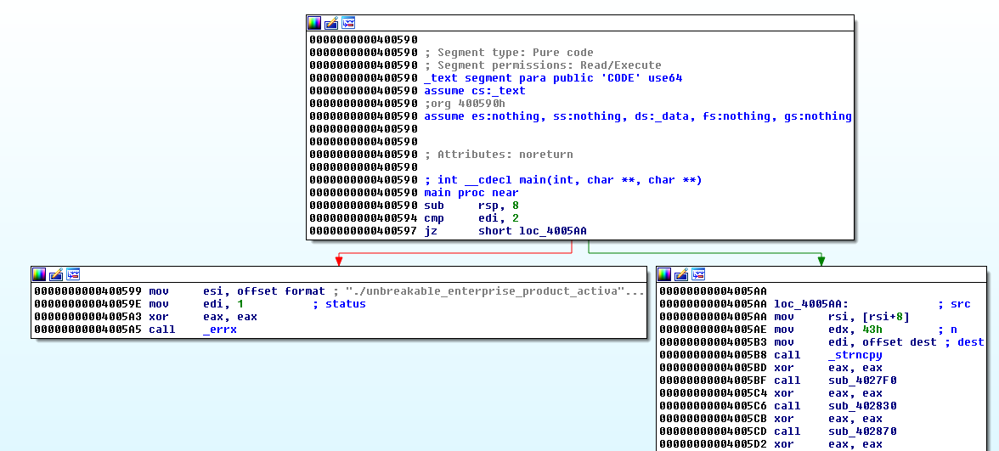

=============================
Google CTF 2016 "Unbreakable"
=============================

Symbolic execution tools are becoming increasingly popular for analyzing binaries in Capture the Flag (CTF) challenges.
Tools such as `Angr <http://angr.io>`_ and `Manticore <https://github.com/trailofbits/manticore>`_ have helped push
symbolic execution into the mainstream and have been used to solve numerous CTF challenges. In this tutorial we
demonstrate that we can do the same with S2E, using it to solve a reverse engineering challenge from the Google CTF
2016. For comparison, solutions for the challenge using `Angr
<https://github.com/angr/angr-doc/blob/master/examples/google2016_unbreakable_0>`_ and
`Manticore <https://github.com/trailofbits/manticore-examples/tree/master/google2016_unbreakable>`_ are also available.

.. contents::

Getting started
---------------

We assume that you have already created an S2E environment using the ``s2e-env`` tool. You will also need to build the
Debian x86_64 image. If you have not already done this, please following the instructions `here <../s2e-env.rst>`_.

The challenge binary can be downloaded from `here
<https://github.com/trailofbits/manticore-examples/raw/master/google2016_unbreakable/unbreakable>`_.

Initial analysis
----------------

As other `writeups
<http://www.99cruster.com/blog/2016/05/02/google-ctf-2016-unbreakable-enterprise-product-activation-writeup-using-angr/>`_
have discussed, an initial static analysis in a tool such as IDA Pro reveals that the binary (a 64-bit ELF executable)
accepts a single command line argument (the product activation code). If this argument is not provided the program will
print a usage message and exit.



If the product activation code is provided, the argument is copied into the global buffer ``dest``. The ``strncpy``
operation (at address ``0x4005B8``) copies 67 characters, so we can surmise that the product activation code is 67
characters long. We are also told that the product activation code starts with "CTF{".

Further analysis reveals that function at ``0x400850`` will be called when an incorrect product activation code is
given. The correct product activation call will result in the function at ``0x400830`` being called and the message
"Thank you - product activated!" printed. Therefore, when exploring the various program branches we want to focus on
states that will lead to ``0x400830`` and avoid those that lead to ``0x400850``. With this information, we can develop
an S2E plugin to solve the challenge.

Creating the S2E project
------------------------

Use ``s2e-env``'s ``new_project`` command to create a new analysis project for the unbreakable binary. We can also use
our knowledge about the product activation code to automatically add the command line argument to the bootstrap script.
Create the project using the following command:

.. code-block:: console

    s2e new_project --image debian-8.7.1-x86_64 /path/to/unbreakable \
        `python -c "print('CTF{%s' % ('x' * (67 - 4)))"`

The Python code will generate a 67 character string starting with "CTF{". The actual contents of the string are not
important, however using our existing knowledge will help `concolic <../Howtos/Concolic.rst>`_ execution. The length of
the string **is** important, so you must ensure that it is 67 characters long.

As usual, the ``new_project`` command will generate a bootstrap script and S2E configuration file. First, we must edit
the bootstrap script to make our product activation code symbolic. Open ``projects/unbreakable/bootstrap.sh`` and go to
the ``execute_target`` function. Set the empty ``S2E_SYM_ARGS`` environment variable to "1" (i.e.
``S2E_SYM_ARGS="1"``), which instructs S2E to make the first argument (the product activation code) symbolic. We will
return to the ``s2e-config.lua`` configuration file after we have written our S2E plugin.

You might also notice that the printed instructions contains a message regarding the `FunctionModels
<../Plugins/Linux/FunctionModels.rst>`_ plugin. We will return to this later.

Writing the S2E plugin
----------------------

We will develop a custom plugin to solve this challenge. The following section will step through the design and
implementation process for this plugin. For reference, the final plugin is available in the `libs2eplugins
<https://github.com/S2E/libs2eplugins>`_ repository under ``src/s2e/Plugins/Tutorials/GoogleCTFUnbreakable.{cpp,h}``.
Previous experience with `writing S2E plugins <../Howtos/WritingPlugins.rst>`_ will help, however it is not mandatory.

Start with the standard S2E plugin template. In ``GoogleCTFUnbreakable.h``:

.. code-block:: cpp

    #ifndef S2E_PLUGINS_GOOGLE_CTF_UNBREAKABLE_H
    #define S2E_PLUGINS_GOOGLE_CTF_UNBREAKABLE_H

    #include <s2e/CorePlugin.h>
    #include <s2e/Plugin.h>

    namespace s2e {
    namespace plugins {

    class GoogleCTFUnbreakable : public Plugin {
        // Declares an S2E plugin
        S2E_PLUGIN

    public:
        // Our constructor doesn't need to do anything
        GoogleCTFUnbreakable(S2E *s2e) : Plugin(s2e) { }

        // This will be called by S2E when registering and configuring the different plugins
        void initialize();

    private:
        // We will add some more methods later
    };

    } // namespace plugins
    } // namespace s2e

    #endif

And in ``GoogleCTFUnbreakable.cpp``:

.. code-block:: cpp

    #include <s2e/S2E.h>

    #include "GoogleCTFUnbreakable.h"

    namespace s2e {
    namespace plugins {

    S2E_DEFINE_PLUGIN(GoogleCTFUnbreakable, // Plugin class
                      "Solve the Google CTF unbreakable product activation code", // Plugin description
                      "", // Unused
                      ); // Plugin dependencies (currently there are none)

    void GoogleCTFUnbreakable::initialize() {
    }

    } // namespace plugins
    } // namespace s2e

This is a perfectly valid S2E plugin. However, it does not do anything useful. We need to think about what events we
are interested in. We can then write code to do something useful when these events occur during runtime. To get an idea
of the different events that can occur, look in `CorePlugin.h
<https://github.com/S2E/libs2ecore/blob/master/include/s2e/CorePlugin.h>`_. In addition to those generated by the
``CorePlugin``, events can also be generated by other plugins. For example, the `OSMonitor
<https://github.com/S2E/libs2eplugins/tree/master/src/s2e/Plugins/OSMonitors>`_ plugin generates events for process
creation, module loading and unloading, etc.

What kind of events are we interested in? From our initial analysis we know the addresses of program code that indicate
success and failure. We can therefore use the ``onTranslateInstructionStart`` event to notify us when the code at these 
addresses is translated by QEMU. Declare the event handler in ``GoogleCTFUnbreakable.h``:

.. code-block:: cpp

    private:
        // The method signature corresponds to the onTranslateInstructionStart signal template in CorePlugin.h
        void onTranslateInstruction(ExecutionSignal *signal, S2EExecutionState *state, TranslationBlock *tb,
                                    uint64_t pc);

We also need to register our interest in this event, which we do in the plugin's ``initialize`` method.

.. code-block:: cpp

    void GoogleCTFUnbreakable::initialize() {
        s2e()->getCorePlugin()->onTranslateInstructionStart.connect(
            sigc::mem_fun(*this, &GoogleCTFUnbreakable::onTranslateInstruction));
    }

We previously stated that the ``onTranslateInstructionStart`` event occurs when code is translated by QEMU. We need to
register another event listener to notify our plugin when the code is actually executed. We do this using the
``ExecutionSignal`` that is generated by the ``onTranslateInstructionStart`` event. In ``GoogleCTFUnbreakable.cpp``
(don't forget to add the method declarations to ``GoogleCTFUnbreakable.h``):

.. code-block:: cpp

    // We found these addresses during our initial analysis in IDA Pro.
    // Note that we assume non-PIE addresses
    static const uint64_t SUCCESS_ADDRESS = 0x400724;
    static const uint64_t FAILURE_ADDRESS = 0x400850;

    void GoogleCTFUnbreakable::onTranslateInstruction(ExecutionSignal *signal, S2EExecutionState *state,
                                                      TranslationBlock *tb, uint64_t pc) {
        if (pc == SUCCESS_ADDRESS) {
            // Register a handler for when the "success" code is executed
            signal->connect(sigc::mem_fun(*this, &GoogleCTFUnbreakable::onSuccess));
        } else if (pc == FAILURE_ADDRESS) {
            // Register a handler for when the "failure" code is executed
            signal->connect(sigc::mem_fun(*this, &GoogleCTFUnbreakable::onFailure));
        }
    }

    void GoogleCTFUnbreakable::onSuccess(S2EExecutionState *state, uint64_t pc) {
        // We will return to this later
    }

    void GoogleCTFUnbreakable::onFailure(S2EExecutionState *state, uint64_t pc) {
        // There is no reason to continue execution any further. So kill the state
        s2e()->getExecutor()->terminateStateEarly(*state, "Invalid path");
    }

Once execution reaches either the success or failure code, there is no reason to continue. We therefore kill the states
to avoid wasting resources.

Note that we use absolute addresses for our success and failure code. For position independent code (PIE), you will
need to register for module load events, record the load address of the module you are interested in (in this case
unbreakable) and calculate the success and failure addresses via offsets at run time.

Unfortunately, there is a problem with our plugin. Recall that S2E performs full-system emulation, meaning other
processes may be executing at the same time that we are analysing unbreakable. Virtual addressing also means that there
may be other processes that have code at ``SUCCESS_ADDRESS`` and ``FAILURE_ADDRESS``. If this code is executed, our
plugin's ``onSuccess`` and ``onFailure`` methods will execute, potentially interfering with our analysis. We will avoid
this problem with another plugin, the ``ProcessExecutionDetector`` plugin.

The ``ProcessExecutionDetector`` tracks the execution of processes in the system. It is configurable so that only
processes of interest are tracked. To add this plugin as a dependency, in ``GoogleCTFUnbreakable.cpp``:

.. code-block:: cpp

    #include <s2e/Plugins/OSMonitors/Support/ProcessExecutionDetector.h>

    S2E_DEFINE_PLUGIN(GoogleCTFUnbreakable,
                      "Solve the Google CTF unbreakable product activation code",
                      "",
                      "ProcessExecutionDetector"); // Plugin dependency

    void GoogleCTFUnbreakable::initialize() {
        m_procDetector = s2e()->getPlugin<ProcessExecutionDetector>();

        // ...
    }

And add the ``ProcessExecutionDetector`` as a private member of the ``GoogleCTFUnbreakable`` class:

.. code-block:: cpp

    // In GoogleCTFUnbreakable.h
    class GoogleCTFUnbreakable : public Plugin {
    // ...

    private:
        ProcessExecutionDetector *m_procDetector;

    // ...
    };

Now we can filter out all other processes **except** the unbreakable process. The following code should be added to the
**beginning** of the ``onTranslateInstruction`` event handler:

.. code-block:: cpp

    void GoogleCTFUnbreakable::onTranslateInstruction(ExecutionSignal *signal, S2EExecutionState *state,
                                                      TranslationBlock *tb, uint64_t pc) {
        // The processes to track are declared in the S2E LUA configuration file
        if (!m_procDetector->isTracked(state)) {
            return;
        }

        // ...
    }

This takes care of our success and failure paths. What about the rest of our initial analysis? Recall that we are told
that the activation code begins with "CTF{". How can we encode this knowledge in our plugin?

Recall that we use the ``S2E_SYM_ARGS`` environment variable to make the program argument (i.e. the activation code)
symbolic. We can use the ``onSymbolicVariableCreation`` event to wait for the activation code to become symbolic, and
then constrain this variable with our existing knowledge. In ``GoogleCTFUnbreakable.cpp``:

.. code-block:: cpp

    #include <klee/util/ExprTemplatees.h>

    // Register our onSymbolicVariableCreation event handler
    void GoogleCTFUnbreakable::initialize() {
        s2e()->getCorePlugin()->onSymbolicVariableCreation.connect(
            sigc::mem_fun(*this, &GoogleCTFUnbreakable::onSymbolicVariableCreation));

        // ...
    }

    void GoogleCTFUnbreakable::onSymbolicVariableCreation(S2EExecutionState *state, const std::string &name,
                                                          const std::vector<klee::ref<klee::Expr>> &expr,
                                                          const klee::MemoryObject *mo, const klee::Array *array) {
        // This check is not strictly required, because we only have one symbolic variable in the analysis.
        //
        // The first program argument made symbolic with the S2E_SYM_ARGS environment variable will have the name
        // "arg1".
        if (name != "arg1") {
            return;
        }

        // We know that the product activation key starts with "CTF{". We encode this information as KLEE constraints
        state->constraints.addConstraint(E_EQ(expr[0], E_CONST('C', klee::Expr::Int8)));
        state->constraints.addConstraint(E_EQ(expr[1], E_CONST('T', klee::Expr::Int8)));
        state->constraints.addConstraint(E_EQ(expr[2], E_CONST('F', klee::Expr::Int8)));
        state->constraints.addConstraint(E_EQ(expr[3], E_CONST('{', klee::Expr::Int8)));
    }

Encoding this information in the form of additional constraints helps to speed up symbolic execution. Now the
constraint solver will not waste time generating solutions which we know are not viable (e.g. activation codes
beginning with "ABCD", "1337", etc.).

Note that we could have also encoded additional constraints for our solution. For example, we can surmise that none of
the remaining characters is a NULL terminator.

.. code-block:: cpp

    for (unsigned i = 4; i < expr.size(); ++i) {
        state->constraints.addConstraint(E_NEQ(expr[i], E_CONST('\0', klee::Expr::Int8)));
    }

An alternate set of constraints could also be that the other remaining characters must be printable ASCII characters.

.. code-block:: cpp

    for (unsigned i = 4; i < expr.size(); ++i) {
        state->constraints.addConstraint(E_GE(expr[i], E_CONST(' ', klee::Expr::Int8)));
        state->constraints.addConstraint(E_LE(expr[i], E_CONST('~', klee::Expr::Int8)));
    }

In practice we found that these additional constraints on the remaining 63 characters can have a significant impact on
performance. We will discuss this later.

The final step is to complete the ``onSuccess`` method. This involves solving the constraints accumulated during
symbolic execution and displaying the result.

.. code-block:: cpp

    #include <cctype>
    #include <stringstream>

    void GoogleCTFUnbreakable::onSuccess(S2EExecutionState *state, uint64_t pc) {
        // `results` is a vector containing pairs of strings and a vector of bytes. The string corresponds to the
        // symbolic variable's name while the vector of bytes is the actual solution
        std::vector<std::pair<std::string, std::vector<unsigned char>>> results;

        // Invoke the constraint solver
        if (!s2e()->getExecutor()->getSymbolicSolution(*state, results)) {
            getWarningsStream(state) << "Unable to generate a solution for the product activation code\n";
            exit(1);
        }

        // Since we only have a single symbolic variable, we will only have a single result. We then iterate over the
        // bytes in this result to print the solution
        std::stringstream ss;
        for (auto c : results[0].second) {
            if (!std::isprint(c)) {
                break;
            }
            ss << (char) c;
        }

        getInfoStream(state) << "Product activation code = " << ss.str() << "\n";

        // No need to continue running S2E - terminate
        exit(0);
    }

With the plugin complete, we need to ensure that it is compiled with the other S2E plugins. To do this, add the
following to ``libs2eplugins/src/CMakeLists.txt``:

.. code-block:: cmake

    src/Plugins/Tutorials/GoogleCTFUnbreakable.cpp

S2E will need to be rebuilt to ensure that our plugin is compiled and available for the analysis. Do

.. code-block:: console

    s2e build --clean-target libs2e

Capturing the flag
------------------

With the plugin complete, we can use it to solve the challenge. First, the plugin must be enabled in our project's S2E
configuration file. By default, ``s2e new_project`` will generate a ``s2e-config.lua`` file with a standard set of
plugins enabled and configured. However, most of them are unneeded for this challenge. At a minimum the following
plugins **must** be enabled:

GoogleCTFUnbreakable
    Our custom plugin for solving the challenge.

BaseInstructions
    Required for all S2E analyses.

HostFiles
    Required to transfer the unbreakable binary to the guest VM.

LinuxMonitor
    Required to detect the start of the unbreakable process.

ProcessExecutionDetector
    Required to check what process is currently running. By default ``s2e-env`` should have already configured this
    plugin to track the unbreakable plugin. If not, add "unbreakable" to the ``moduleNames`` table of
    ``pluginsConfig.ProcessExecutionDetector``.

With this, we can start S2E with the ``launch-s2e.sh`` script. After a while S2E will terminate and we should see the
flag displayed in the terminal output:

.. code-block::

    Product activation code = CTF{0The1Quick2Brown3Fox4Jumped5Over6The7Lazy8Fox9}

Exploring performance
---------------------

We can now return to our discussion on (1) the ``FunctionModels`` plugin and (2) the performance impact caused by
enforcing additional constraints on the product activation code.

Using the FunctionModels plugin
```````````````````````````````

The ``FunctionModels`` plugin, as described `here <../Plugins/Linux/FunctionModels.rst>`_, attempts to reduce the path
explosion problem. ``s2e-env`` analyzes the unbreakable binary when the ``new_project`` command is executed and
determines that the binary imports the ``strncpy`` function, for which a model exists.

``strncpy`` is typically implemented as a loop over the input string until either a NULL terminator is found or ``n``
characters have been copied. By analyzing the binary in a tool such as IDA Pro we can see that this input string is the
product activation key, which is symbolic. Looping over a symbolic string will result in a greater number of states
forked, because any of the 63 characters following the "CTF{" prefix could contain a NULL terminator.

By enabling the ``FunctionModels`` plugin, the ``strncpy`` loop will be replaced by a single symbolic expression,
reducing the total number of states forked. We will examine the performance trade-offs of doing so in the following
section.

To enable the ``FunctionModels`` plugin, add the following to ``s2e-config.lua``:

.. code-block:: lua

    add_plugin("FunctionModels")

Measuring performance
`````````````````````

With the flag successfully captured, we can now explore the various performance trade-offs that must be taken into
account when we (1) further constrain the product activation key and (2) use the ``FunctionModels`` plugin. An overview
of the results is given in the table below. For the "explore all states" results we removed the call to ``exit`` in the
``onSuccess`` method, even after capturing the flag (in practice this is unnecessary). For reference we also give the
Angr results as quoted from their source code and the results from running Manticore ourselves.

+-----------------------------------------------+-------------+------------+-------------+------------+
|                                               | Terminate on solution    | Explore all states       |
| Description                                   +-------------+------------+-------------+------------+
|                                               | Time (secs) | No. states | Time (secs) | No. states |
+-----------------------------------------------+-------------+------------+-------------+------------+
| No additional constraints on the input string | 12          | 111        | 240         | 1720       |
+-----------------------------------------------+-------------+------------+-------------+------------+
| No NULL terminator within the input string    | 12          | 49         | 12          | 49         |
+-----------------------------------------------+-------------+------------+-------------+------------+
| All characters must be printable ASCII        | 3,180       | 44         | 3,180       | 44         |
+-----------------------------------------------+-------------+------------+-------------+------------+
| Using FunctionModels                          | 13          | 49         | 13          | 49         |
+-----------------------------------------------+-------------+------------+-------------+------------+
| Angr                                          | 4.5         | N/A        | N/A         | N/A        |
+-----------------------------------------------+-------------+------------+-------------+------------+
| Manticore                                     | 60          | N/A        | N/A         | N/A        |
+-----------------------------------------------+-------------+------------+-------------+------------+

The first set of results are our baseline. The only constraints that we impose are that the product activation code
begins with "CTF{"; the remaining 63 characters are unconstrained. Of the 111 states forked before the solution is
found, 62 of them occurred within ``strncpy``. These 62 states correspond to the NULL terminator being located within
one of the remaining 63 characters (e.g. "CTF{\\0", "CTF{x\\0", "CTF{xxxxxxxx\\0", etc.). However, the depth-first
search (DFS) strategy means that none of these 62 states is scheduled for execution before the solution is found. The
total number of states quickly explodes otherwise.

Now observe the performance after we constrain the remaining 63 characters of the product activation code to
**exclude** the NULL terminator. The total number of states is reduced to 49. While this has negligible impact on
execution time when we terminate after the solution is found (again due to DFS), the total number of states does not
explode.

Performance degrades significantly when we over-constrain the product activation code to **only** contain printable
ASCII characters. While the total number of states is reduced, the bottleneck is simply transferred from state
exploration to the constraint solver.

**NOTE**: To view the symbolic formulae during execution the ``--verbose-fork-info`` can be added to the ``kleeArgs``
table in ``s2e-config.lua``.

Finally, we find that the ``FunctionModels`` plugin reduces the state space to the same levels as when we excluded
NULL terminators from the product activation code. However, like when we over-constrain, the formula that the
constraint solver must solve grows increasingly complex after the ``strncpy`` model is applied and the constraint
solver once again becomes the bottleneck.

The aim of this section has been to introduce you to some of the nuances in S2E (and symbolic execution in general).
Generally, it is only through experimentation that we can find the optimal trade-off between the number of states to
explore vs. the complexity of the formulae that must be solved by the constraint solver.

Conclusion
----------

Compared to the Angr and Manticore solutions, solving this challenge with S2E may seem overly complex. There are a
variety of reasons for this: S2E runs a full-system emulator, so the user must handle the full software stack (OS
kernel, libraries, drivers, etc.); S2E is written in C++; and S2E is built on top of many different tools and
frameworks (KLEE, QEMU, LLVM, etc.), each with their own APIs. Ultimately it is a matter of selecting the correct tool
for the job. For CTF-style challenges, where the program is largely self-contained and has very little interaction with
the rest of the system (e.g. the OS, libraries such as libc, etc.), using the power of full-system emulation is
probably overkill (however, as this tutorial demonstrates, it can be done!). However for more complex software (e.g.
device drivers, software with more complex interaction with the system, etc.), S2E may be the more suitable choice.
